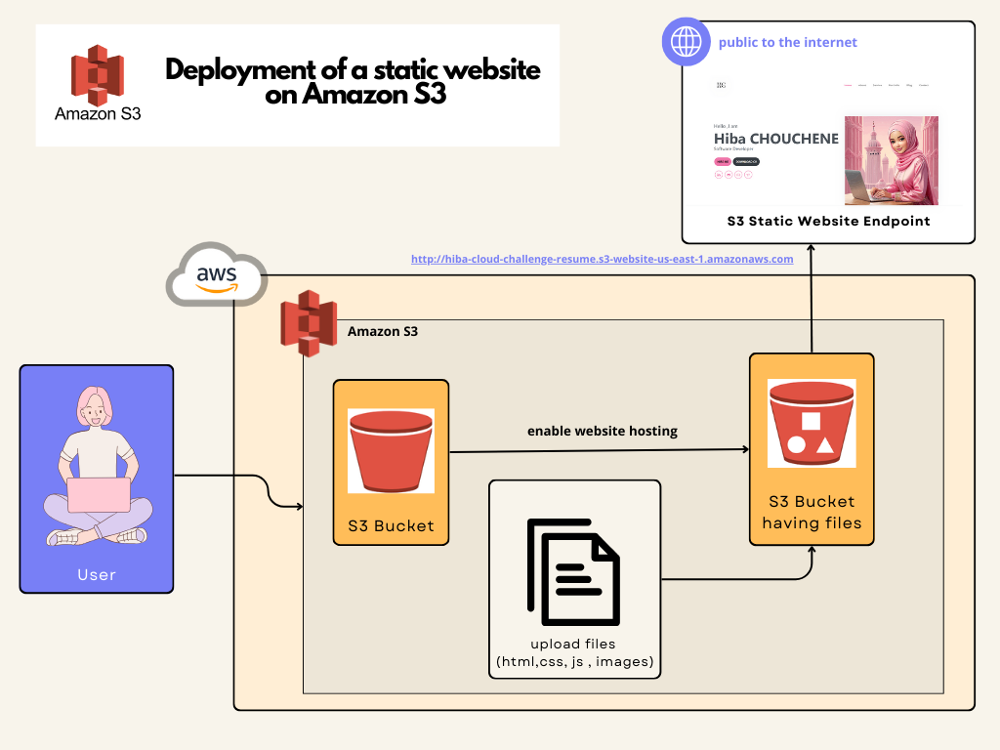

#  🚀 Deployment of a static website on Amazon S3 - AWS ☁️

## Step-by-Step Guide:

1. Create an S3 Bucket:

* Log in to the AWS Management Console.
* Navigate to the S3 service.
* Click on "Create bucket".
* Enter a unique bucket name (e.g., my-resume-bucket).
* Choose the AWS region closest to you.
* Uncheck the "Block all public access" option to allow public access to your website.
* Acknowledge that you understand the risks of enabling public access.
* Click "Create bucket".

2. Upload HTML and CSS Files:

* Click on your newly created bucket.
* Click on the "Upload" button.
* Add your HTML and CSS files (e.g., index.html and styles.css).
* Click "Upload" to start the upload process.

3. Configure the Bucket for Static Website Hosting:

* Go to the "Properties" tab of your S3 bucket.
* Scroll down to the "Static website hosting" section.
* Select "Use this bucket to host a website".
* In the "Index document" field, enter index.html.
* (Optional) If you have an error page, enter its filename in the "Error document" field.
Click "Save changes".

4. Set Permissions to Make the Bucket Public:

* Go to the "Permissions" tab of your S3 bucket.
* Click on "Bucket Policy".
* Paste the following policy into the editor, replacing your-bucket-name with your actual bucket name:

json :

``
{
    "Version": "2012-10-17",
    "Statement": [
        {
            "Sid": "PublicReadGetObject",
            "Effect": "Allow",
            "Principal": "*",
            "Action": "s3:GetObject",
            "Resource": "arn:aws:s3:::your-bucket-name/*"
        }
    ]
}
``

* Click "Save".

5. Enable CORS Configuration:

* Go to the "Permissions" tab of your S3 bucket.
* Click on "Cross-origin resource sharing (CORS)".
* Paste the following CORS configuration:

json:

``
[
    {
        "AllowedHeaders": [
            "*"
        ],
        "AllowedMethods": [
            "GET"
        ],
        "AllowedOrigins": [
            "*"
        ],
        "ExposeHeaders": [],
        "MaxAgeSeconds": 3000
    }
]
``
* Click "Save" to apply the CORS rules to your bucket.

6. Access Your Static Website:

* Go back to the "Properties" tab.
* In the "Static website hosting" section, you’ll see the "Endpoint" URL.
* Click on the URL to access your deployed resume website.

