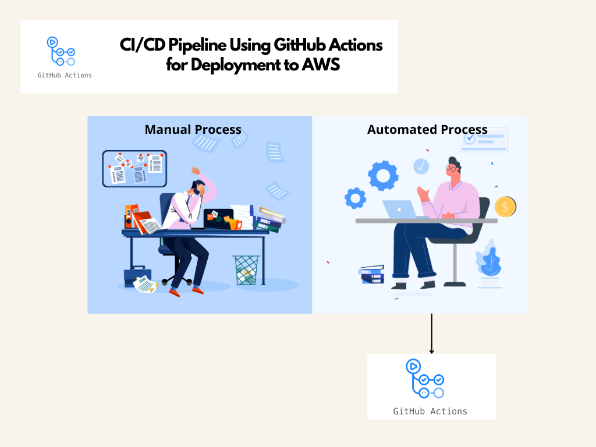

# 🚀 CI/CD Pipeline Using GitHub Actions for Deployment to AWS ☁️:

This part demonstrates the power of **automation** using **CI/CD pipelines** with **GitHub Actions** for deploying both frontend and backend components to AWS.

## Frontend: Deploy Static Website to S3
Automate the deployment of a static website to an Amazon S3 bucket, ensuring continuous and seamless updates.

## Backend: Deploy to AWS Lambda Function
Automate the deployment of backend code to AWS Lambda, ensuring prompt updates and reliable performance.

By using GitHub Actions, we achieve efficient, consistent, and reliable deployments, allowing us to focus on development without manual deployment tasks.

 