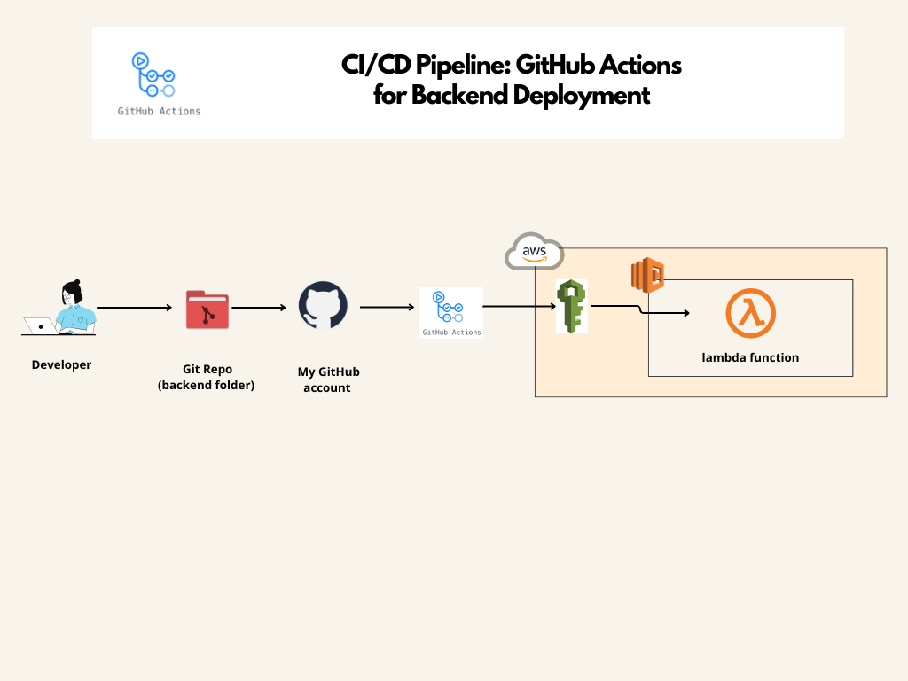

#  🚀 CI/CD Pipeline : GitHub Actions for Backend Deployment ☁️: 

This part demonstrates how to automate the deployment of a Node.js-based Lambda function to AWS using GitHub Actions. The workflow is triggered on every push to the main branch, ensuring that the latest version of the backend code is always deployed.

### Prerequisites :
Before setting up the CI/CD pipeline, ensure you have the following:

- An AWS account
- A Lambda function configured in AWS
- AWS IAM user with necessary permissions (e.g., AWSLambdaFullAccess, IAMFullAccess, and AmazonAPIGatewayInvokeFullAccess)
- GitHub repository with the backend code

### Repository Structure
The repository is structured as follows:

backend/

│

├── .github/

│   └── workflows/

│       └── ci-cd-lambda.yaml        # GitHub Actions workflow file

│
├── index.js                 # Main Lambda function code

├── package.json             # Node.js dependencies and scripts

└── tests/

    └── index.test.js        # Jest test file

│

### Setup Instructions 

1. Clone the repository:

bash
``git clone https://github.com/your-username/backend.git
``

``
cd backend
``

2. Create an IAM user and obtain credentials:

* Create an IAM user with programmatic access.
* Attach the necessary policies (e.g., AWSLambdaFullAccess, IAMFullAccess).
* Note the Access Key ID and Secret Access Key.

3. Add GitHub Secrets:
* Go to your GitHub repository's Settings > Secrets and variables > Actions.
* Add the following secrets:

  * AWS_ACCESS_KEY_ID
  * AWS_SECRET_ACCESS_KEY
  * AWS_REGION

## Steps Breakdown:

1. **Trigger the Workflow:** The workflow triggers on a push to the main branch.
2. **Checkout Code:** Uses the actions/checkout action to pull the latest code from the repository.
3. **Set Up Node.js:** Uses the actions/setup-node action to set up the Node.js environment.
4. **Install Dependencies:** Installs project dependencies using npm install.
5. **Run Tests:** Executes the test suite using Jest.
6. **Configure AWS Credentials:** Uses the aws-actions/configure-aws-credentials action to set up AWS credentials using the secrets stored in GitHub.
7. **Deploy Lambda Function:**  Zips the Lambda function code and deploys it using the AWS CLI command aws lambda update-function-code.

