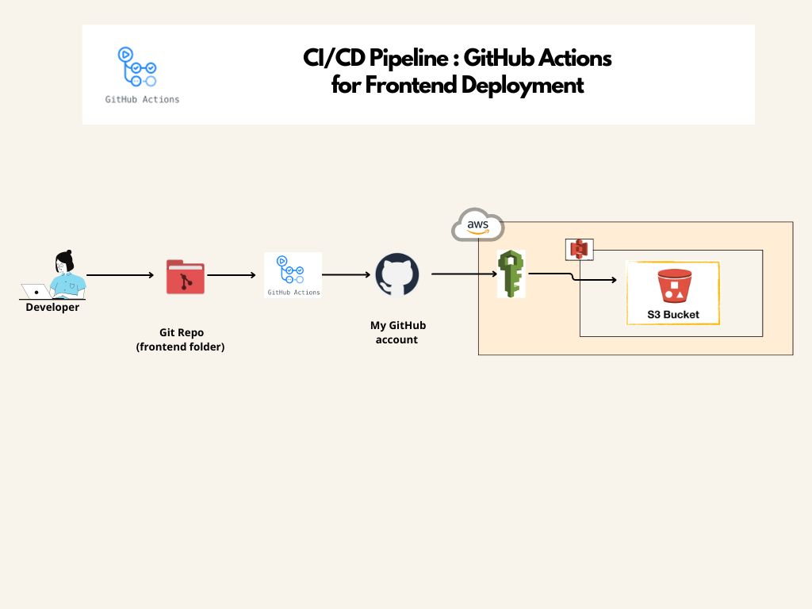

#  🚀CI/CD Pipeline : GitHub Actions for Frontend Deployment ☁️ :

This part demonstrates how to automate the deployment of a static website to an AWS S3 bucket using GitHub Actions. The workflow is triggered on every push to the main branch, ensuring that the latest version of the website is always deployed.

### Prerequisites :
Before setting up the CI/CD pipeline, ensure you have the following:

- An AWS account
- An S3 bucket configured for static website hosting
- AWS IAM user with AmazonS3FullAccess permissions
- GitHub repository with the static website files

### Repository Structure
The repository is structured as follows:

frontend/

│

├── .github/

│   └── workflows/

│       └── ci-cd-aws-s3.yaml        # GitHub Actions workflow file

│
├── index.html                # Main HTML file

├── assets/

│   ├── css/                  # CSS files

│   ├── js/                   # JavaScript files

│   └── images/               # Image files

│

### Setup Instructions 

1. Clone the repository:

bash
``
git clone https://github.com/your-username/frontend.git

cd frontend
``

2. Create an S3 bucket:

* Create an S3 bucket in the AWS Management Console and enable static website hosting.
* Create an IAM user and obtain credentials:

3. Create an IAM user with programmatic access.
* Attach the AmazonS3FullAccess policy.
* Note the Access Key ID and Secret Access Key.

4. Add GitHub Secrets:
* Go to your GitHub repository's Settings > Secrets and variables > Actions.
* Add the following secrets:

  * AWS_ACCESS_KEY_ID
  * AWS_SECRET_ACCESS_KEY
  * AWS_REGION
  * S3_BUCKET_NAME

## Steps Breakdown:

1. **Trigger the Workflow:** The workflow triggers on a push to the main branch.
2. **Checkout Code:** Uses the actions/checkout action to pull the latest code from the repository.
3. **Configure AWS Credentials:** Uses the aws-actions/configure-aws-credentials action to set up AWS credentials using the secrets stored in GitHub.
4. **Sync Files to S3:** Uses the AWS CLI to sync the repository files to the S3 bucket.

