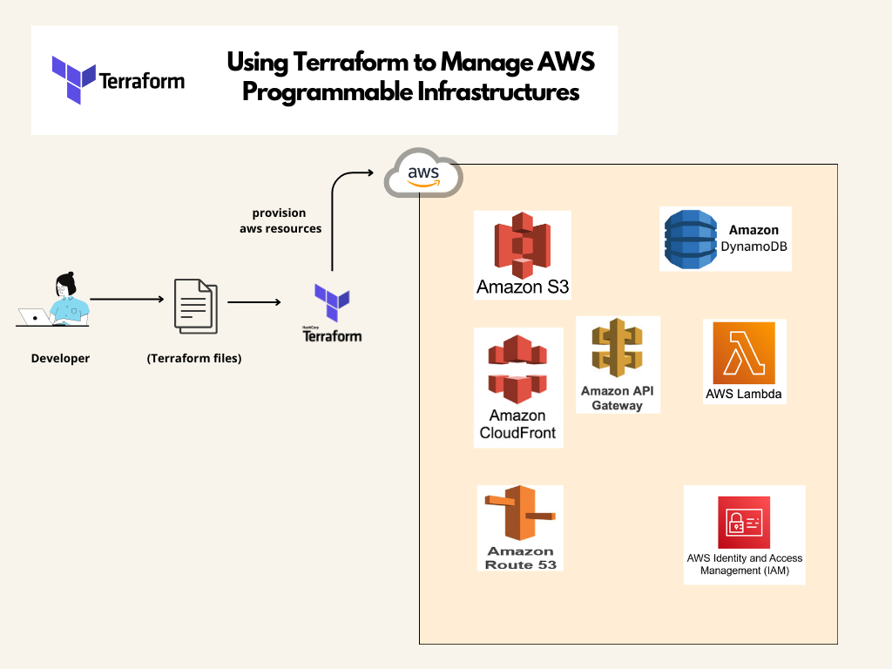

# Using Terraform to Manage AWS Programmable Infrastructures

For our Cloud Resume Challenge, using Terraform for Infrastructure as Code (IaC), you can configure the following components:

* **Amazon S3:** Define an S3 bucket to host your static website.
* **Amazon CloudFront:** Set up a CloudFront distribution to serve your website over HTTPS.
* **DNS with Route 53:** Configure Route 53 to point your custom domain to the CloudFront distribution.
* **DynamoDB:** Create a DynamoDB table to store the visitor counter data.
* **API Gateway:** Set up API Gateway to handle requests from your web application.
* **AWS Lambda:** Create Lambda functions to interact with DynamoDB and handle API requests.
* **IAM Roles and Policies:** Define IAM roles and policies to grant necessary permissions to your Lambda functions and other resources.

## Directory Structure

terraform/

├── main.tf

├── variables.tf

├── outputs.tf

├── s3.tf

├── cloudfront.tf

├── route53.tf

├── dynamodb.tf

├── api_gateway.tf

├── lambda.tf

├── iam.tf

### Running Terraform
To deploy the infrastructure, navigate to the directory containing your main.tf file and run the following commands:

  ```bash

terraform init
terraform plan
terraform apply

 ```

