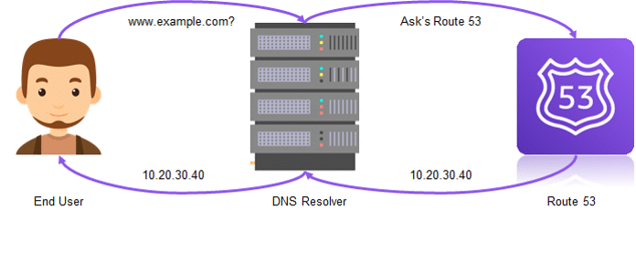

#  Purchase a custom domain and point it to your CloudFront distribution using Route 53 - AWS ☁️

## Step-by-Step Guide:

1. Buy a Domain Name from Hostinger

* Purchase Domain:
    - Go to Hostinger.
    - Search for your desired domain name (e.g., cloud-challenge-resume.cloud).
    - Complete the purchase process.

2. Create a Hosted Zone in Route 53

* Navigate to Route 53:
* Open the Route 53 console.
* Create a Hosted Zone:
    - Click on "Create hosted zone".
    - Enter the domain name you purchased (e.g., cloud-challenge-resume.cloud).
    - Set the type to "Public Hosted Zone".
    - Click "Create hosted zone".

* Note the Name Servers:
    - After the hosted zone is created, note the name servers provided by Route 53. You will need to update these in Hostinger.

3. Update Name Servers in Hostinger:

* Log in to Hostinger:
* Go to your Hostinger account.
* Manage Domain:
    - Navigate to the domain management section for cloud-challenge-resume.cloud.
* Update Name Servers:
    - Replace the existing name servers with those provided by Route 53.
    - Save the changes.

4. Request an SSL Certificate from ACM :

* Navigate to ACM:
    - Open the ACM console.
* Request a Public Certificate:
    - Click on "Request a certificate".
    - Choose "Request a public certificate" and click "Next".
* Enter Domain Name:
    - Enter your domain name (e.g., cloud-challenge-resume.cloud).
    - Click "Next".
* Choose Validation Method:
    - Select "DNS validation" and click "Review" and then "Confirm and request".
* Add CNAME Records for Validation:
    - Follow the instructions to add the required CNAME records to your Route 53 hosted zone.
* Complete Validation:
    - Once the CNAME records are added and propagated, ACM will validate the domain and issue the certificate.

5. Update CloudFront to Use SSL Certificate : 

* Navigate to CloudFront:
    - Open the CloudFront console.
* Select Your Distribution:
    - Find and select your CloudFront distribution.
* Edit Distribution Settings:
    - Click on the "Edit" button in the "General" tab.
* Update SSL Certificate:
    - In the "SSL Certificate" section, select "Custom SSL Certificate" and choose the certificate you requested from ACM.
    - Click "Yes, Edit" to save the changes.

6. Update DNS Records to Point to CloudFront : 

* Navigate to Route 53:
    - Open the Route 53 console.
    - Select your hosted zone.
* Create an A Record:
    - Click "Create Record Set".
    - Set the "Name" to your domain (e.g., cloud-challenge-resume.cloud).
    - Set the "Type" to "A - IPv4 address".
    - Select "Alias".
    - In the "Alias Target" dropdown, choose your CloudFront distribution.
    - Click "Create".

7. Verify HTTPS Setup :

* Wait for Propagation:
    - Allow some time for the DNS changes to propagate (this can take a few minutes to a few hours).
* Test Your Domain:
    - Open a web browser and navigate to your custom domain (e.g., https://cloud-challenge-resume.cloud).
    - Verify that your static website loads with HTTPS and displays the correct content.

