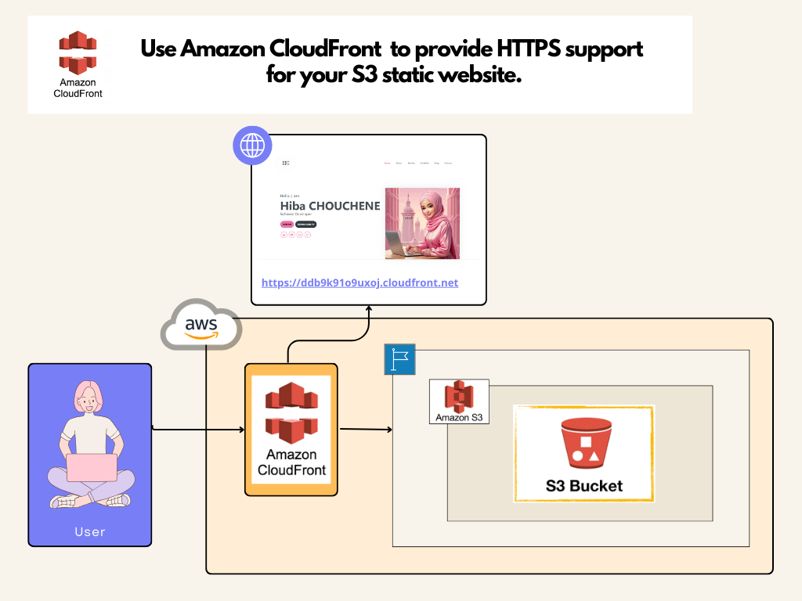

# 🔐  Use Amazon CloudFront  to provide HTTPS support for your S3 static website ☁️

## Step-by-Step Guide:

1. Create a CloudFront Distribution

* Navigate to CloudFront:
* Open the CloudFront console.
* Create a Distribution:

 - Click on "Create Distribution".
 - Choose "Web" delivery method.

    * Origin Settings:

        - For "Origin Domain Name", enter your S3 bucket's website endpoint (e.g., my-resume-bucket.s3-website-us-east-1.amazonaws.com).
        - Ensure "Origin Path" is left blank.
        - Set "Origin ID" to something descriptive like S3-my-resume-bucket.
        - Set "Restrict Bucket Access" to "No".
        - For "Origin Protocol Policy", select "HTTP Only".
    * Default Cache Behavior Settings:

        - For "Viewer Protocol Policy", select "Redirect HTTP to HTTPS".
        - Set other options as needed (leave default values if unsure).
    * Distribution Settings:

        - Configure additional settings as needed (default values are generally fine for initial setup).
    * Click "Create Distribution".

2. Retrieve CloudFront Distribution URL

* View Distribution Details:
    -  Once the distribution is created, go to the CloudFront console.
    - Find your distribution in the list.
    - Copy the "Domain Name" (e.g., ddb9k91o9uxoj.cloudfront.net).

3. Test CloudFront Distribution:

* Open a web browser and navigate to your CloudFront URL: https://ddb9k91o9uxoj.cloudfront.net/.
* Verify that your static website loads correctly from the CloudFront distribution.

