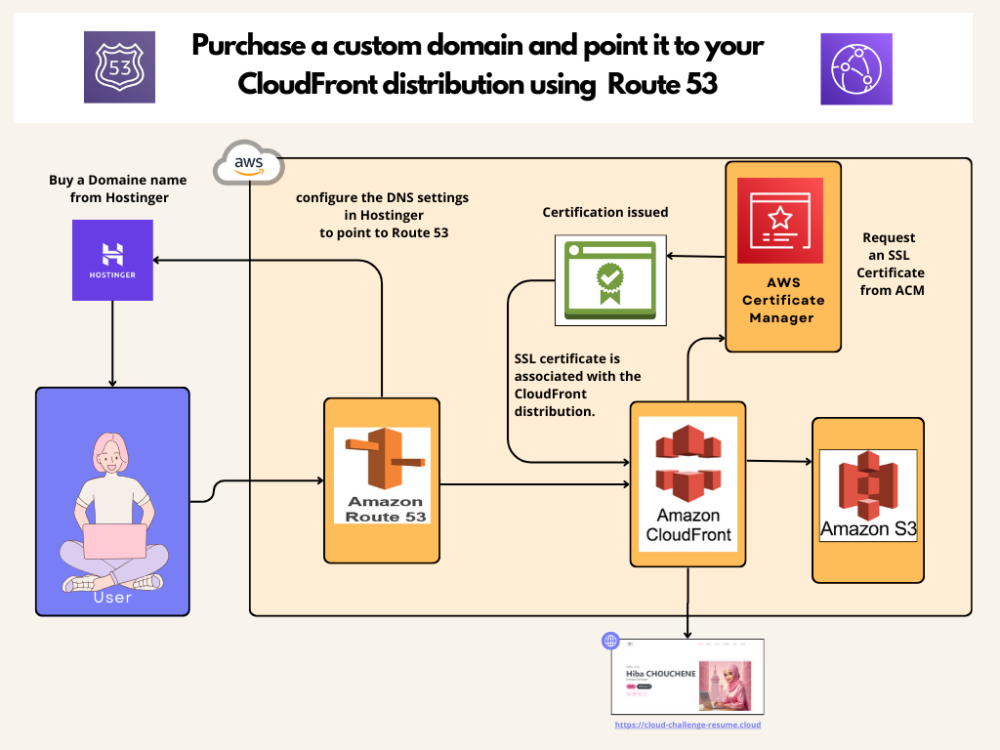

#  🔐 Enhancing Security and Accessibility - AWS ☁️

This phase involves securing the website and making it accessible via a custom domain.

1. HTTPS:

Use **Amazon CloudFront** to provide HTTPS support for your S3 static website.

2. DNS:

Purchase a custom domain and point it to your CloudFront distribution using **Route 53**.

