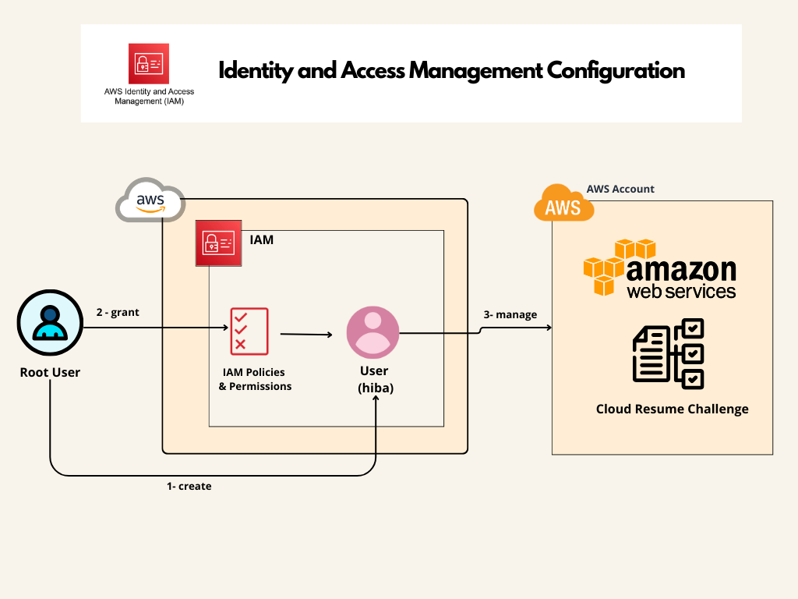

# 🔑 Identity and Access Management Configuration

## Introduction

In this phase, the root user creates a user named Hiba and assigns the necessary permissions required for the project. These permissions are granted through AWS Managed and Customer Managed policies to ensure that Hiba can perform all necessary actions within the AWS environment.

## User Creation and Permission Assignment

1. **User Creation**
   - The root user creates a user named Hiba.

2. **Permissions Granted**
   - The following AWS Managed policies are directly assigned to Hiba:
     - `AmazonAPIGatewayAdministrator`
     - `AmazonDynamoDBFullAccess`
     - `AmazonRoute53DomainsFullAccess`
     - `AmazonRoute53FullAccess`
     - `AmazonS3FullAccess`
     - `AWSCertificateManagerPrivateCAUser`
     - `AWSLambda_FullAccess`
     - `CloudFrontFullAccess`
     - `IAMFullAccess`

3. **Customer Managed Policy**
   - Additionally, a Customer Managed policy named `AmazonACMFullAccess` is assigned directly to Hiba with the following permissions:
     ```json
     {
         "Version": "2012-10-17",
         "Statement": [
             {
                 "Effect": "Allow",
                 "Action": [
                     "acm:RequestCertificate",
                     "acm:ListCertificates",
                     "acm:DescribeCertificate",
                     "acm:ListTagsForCertificate"
                 ],
                 "Resource": "*"
             }
         ]
     }
     ```

This configuration ensures that (hiba) has full access to manage API Gateway, DynamoDB, Route 53, S3, Certificate Manager, Lambda, and CloudFront, as well as the necessary IAM permissions to administer these services effectively.



