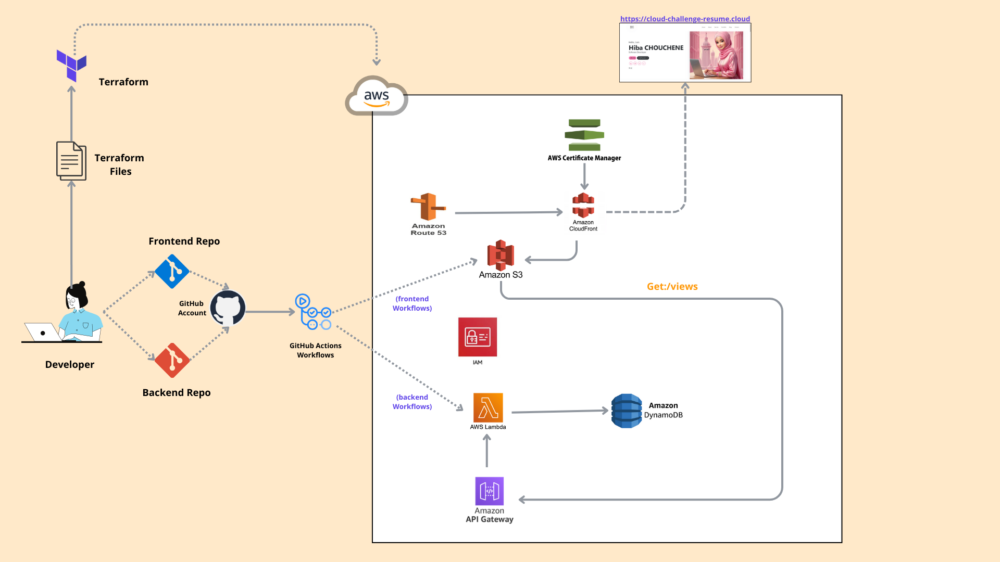
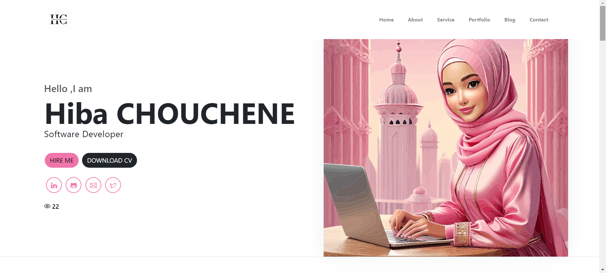

#  🚀 The Cloud Resume Challenge - AWS ☁️
Welcome to my Cloud Resume Challenge repository! This project is based on the Cloud Resume Challenge : 
🧷https://cloudresumechallenge.dev/docs/the-challenge/aws/ , 
which aims to build a personal resume website using various AWS services and modern web development practices.

## Project Overview
This project involves the following steps:

### Certification
Achieved the AWS Cloud Practitioner certification.✅ 
🧷https://www.credly.com/badges/b5be843a-c206-4ce1-aebb-00ee2e3e0e73/public_url 

#### ⚫ HTML
Created a resume in **HTML**. ✅
#### ⚫ CSS
Styled the resume using **CSS**. ✅
#### ⚫ Static Website
Deployed the HTML resume on an **Amazon S3** static website. ✅
#### ⚫ HTTPS
Secured the S3 website URL with HTTPS using **Amazon CloudFront**. ✅
#### ⚫ DNS
Pointed a custom **DNS domain name** to the CloudFront distribution. ✅
#### ⚫ JavaScript
Added a visitor counter to the resume webpage.✅ 
#### ⚫ Database
Used **Amazon DynamoDB** to store and retrieve the visitor count. ✅
#### ⚫ API
Created an API using **AWS API Gateway** and Lambda to interact with the DynamoDB database. ✅
#### ⚫ Python
Wrote the **Lambda function** in Python using the boto3 library. ✅ (I used **Node.js**)
#### ⚫ Tests
Included tests for the **Python** code. ✅
#### ⚫ Infrastructure as Code
Defined the infrastructure using **Terraform**.  ✅
#### ⚫ Source Control
Managed source code with **GitHub** repositories for the project. ✅
#### ⚫ CI/CD 
Set up **GitHub Actions** for continuous integration and deployment of the application (frontend + backend) ✅

## Blog Post
Wrote a blog post about the project and linked it in the resume: https://medium.com/@hibachouchene128/the-cloud-resume-challenge-aws-92868a7e0d54  👌🏻

## Project Setup

## Prerequisites
> - AWS account
> - AWS CLI configured
> - Terraform installed
> - GitHub account
> - Domain name registered

## Steps

🧷 https://cloud-challenge-resume.cloud

