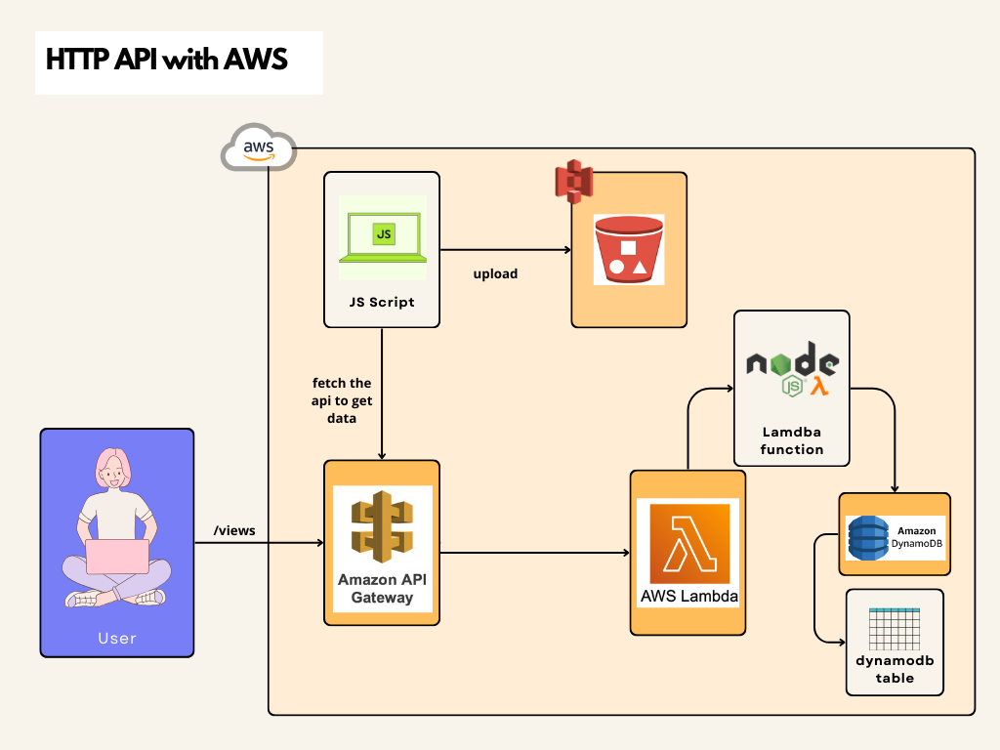
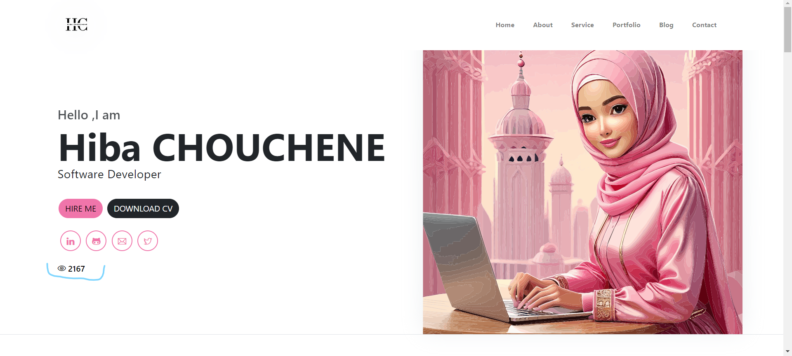

# Serverless Application Development with AWS

## Introduction

This application showcases the power of serverless architecture using AWS Lambda (Node.js), DynamoDB, and API Gateway. The serverless approach allows for scalable and cost-efficient backend development without managing traditional servers.

## Components and Workflow

1. **User Interaction**
   - The user interacts with the application through a web interface. Requests are made to the `/views` endpoint.

2. **Amazon API Gateway**
   - API Gateway serves as the entry point for all client requests. It provides RESTful API endpoints that trigger AWS Lambda functions.

3. **AWS Lambda Function (Node.js)**
   - The Lambda function, written in Node.js, processes the incoming requests. It performs various operations, such as reading and writing data to/from DynamoDB.

4. **Amazon DynamoDB**
   - DynamoDB is a fully managed NoSQL database service used to store and retrieve application data. The Lambda function interacts with the DynamoDB table to perform CRUD operations.

5. **Static Content Hosting on Amazon S3**
   - The static web content, including HTML, CSS, and JavaScript files, is hosted on Amazon S3. The JS script handles fetching data from the API and uploading files to S3.

6. **JavaScript Script**
   - The JS script running on the client side interacts with the API Gateway to fetch data and uploads files to S3.




## Steps to Setup

### 1. Create a DynamoDB Table

1. **Go to the [Amazon DynamoDB Console](https://console.aws.amazon.com/dynamodb/).**
2. **Click on "Create table."**
3. **For Table name, enter `cloud_resume-test`.**
4. **For Partition key, enter `id` (Number).**
5. **Click "Create table."**
6. **Add an item to your table with the following attributes:**
   - `id: 0`
   - `views: 0`

### 2. Create a Lambda Function

1. **Go to the [AWS Lambda Console](https://console.aws.amazon.com/lambda/).**
2. **Click on "Create function."**
3. **Choose "Author from scratch."**
4. **Configure the function:**
   - Function name: `cloudresume-api`
   - Runtime: `Node.js 14.x` (or the latest available)
5. **Under Permissions, choose "Change default execution role."**
6. **Select "Create a new role from AWS policy templates."**
   - Role name: `cloudresume-api-role`
   - For Policy templates, choose `Simple microservice permissions`.
7. **Click "Create function."**
8. **Open the Lambda function in the console's code editor and replace its contents with the following code:**

    ```javascript
    import { DynamoDBClient } from "@aws-sdk/client-dynamodb";
    import { DynamoDBDocumentClient, GetCommand, PutCommand } from "@aws-sdk/lib-dynamodb";

    const client = new DynamoDBClient({});
    const dynamo = DynamoDBDocumentClient.from(client);
    const tableName = "cloud_resume-test";

    export const handler = async (event, context) => {
      let body;
      let statusCode = 200;
      const headers = {
        "Access-Control-Allow-Headers": "*",
        "Access-Control-Allow-Origin": "https://cloud-challenge-resume.cloud", // Allow requests from your domain
        "Access-Control-Allow-Methods": "*", // Allow these HTTP methods
      };

      if (event.httpMethod === 'OPTIONS') {
        return {
          statusCode: 200,
          headers,
          body: JSON.stringify({ message: 'OPTIONS request received' }),
        };
      }

      try {
        const id = 0; // Ensure id is a number
        console.log(`Fetching item with id: ${id}`);

        // Get item from DynamoDB
        const getItemResponse = await dynamo.send(
          new GetCommand({
            TableName: tableName,
            Key: { id },
          })
        );

        if (!getItemResponse.Item) {
          throw new Error('Item not found');
        }

        let views = getItemResponse.Item.views;
        views += 1;

        console.log(`Updating views to: ${views}`);

        // Put item back to DynamoDB with updated views
        await dynamo.send(
          new PutCommand({
            TableName: tableName,
            Item: { id, views },
          })
        );

        body = { views }; // Return the views as a JSON object
      } catch (err) {
        console.error(`Error: ${err.message}`);
        statusCode = 400;
        body = { error: err.message };
      }

      return {
        statusCode,
        body: JSON.stringify(body), // Ensure the response body is a JSON string
        headers,
      };
    };
    ```

9. **Click "Deploy."**

### 3. Create an HTTP API

1. **Go to the [API Gateway Console](https://console.aws.amazon.com/apigateway).**
2. **Click on "Create API" and then choose "Build" under HTTP API.**
3. **For API name, enter `http-cloudresume-api`.**
4. **Click "Next."**
5. **For Configure routes, click "Next" to skip route creation. You will create routes later.**
6. **Review the stage that API Gateway creates for you and then click "Next."**
7. **Click "Create."**

### 4. Create a Route

1. **Go to your API in the API Gateway Console.**
2. **Choose "Routes."**
3. **Click "Create."**
4. **For Method, choose `GET`.**
5. **For Path, enter `/views`.**
6. **Click "Create."**

### 5. Integrate API Gateway with Lambda

1. **Go back to your API in the API Gateway Console.**
2. **Select your route (`/views` with GET method).**
3. **Under "Integrations," choose "Create and attach an integration."**
4. **Choose "Lambda function."**
5. **Select your Lambda function (`cloudresume-api`).**
6. **Click "Attach integration."**

### 6. Configure CORS in API Gateway

1. **Go to the API Gateway Console and select your API.**
2. **Select your route (`/views`).**
3. **Click on "CORS" and configure the following settings:**
   - **Access-Control-Allow-Origin: `https://cloud-challenge-resume.cloud`**
   - **Access-Control-Allow-Headers: `*`**
   - **Access-Control-Allow-Methods: `*`**
   - **Access-Control-Expose-Headers: `*`**
   - **Access-Control-Max-Age: `0`**
   - **Access-Control-Allow-Credentials: `YES`**
4. **Click "Deploy."**

### 7. Implement the JavaScript Client

1. **Update your JavaScript code to interact with the API Gateway:**

    ```javascript
    fetch('https://6j3qnkvxl5.execute-api.us-east-1.amazonaws.com/views')
      .then(response => response.json())
      .then(data => console.log(data))
      .catch(error => console.error('Error:', error));
    ```

### 8. Test the API

1. **Use tools like Postman or your web browser to test the endpoint.**
2. **Make a GET request to `https://6j3qnkvxl5.execute-api.us-east-1.amazonaws.com/views`.**
